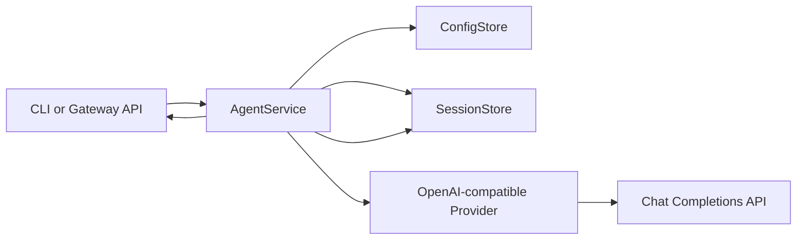

# dart_sub_claw Architecture

## Design Goal

`dart_sub_claw` should start as a compact, understandable Dart core rather than a direct port of every OpenClaw subsystem.
The first implementation keeps the same high-level shape as OpenClaw but chooses smaller contracts:

- CLI as the operator surface.
- Gateway as a local control plane.
- Agent service as the core message execution path.
- Provider abstraction for model calls.
- Session store for durable conversation history.
- Channel abstraction reserved for later messaging integrations.

## OpenClaw Mapping

| OpenClaw area | Current TypeScript path | Dart MVP equivalent |
| --- | --- | --- |
| CLI bootstrap | `src/entry.ts`, `src/cli/program/build-program.ts` | `bin/dart_sub_claw.dart`, executable `dartsub`, `lib/src/cli/cli.dart` |
| Command registration | `src/cli/program/command-registry.ts` | Small switch-based CLI dispatcher |
| Agent turn | `src/commands/agent.ts` | `lib/src/agent/agent_service.dart` |
| Gateway | `src/gateway/server.impl.ts` | `lib/src/gateway/gateway_server.dart` |
| TUI | `src/cli/tui-cli.ts` | `lib/src/tui/repl_tui.dart` |
| Doctor | `src/commands/doctor-*.ts` | `lib/src/doctor/doctor.dart` |
| Provider/model call | `src/agents/*` | `lib/src/providers/*` |
| Sessions | `src/config/sessions.ts`, `src/commands/agent/session*.ts` | `lib/src/sessions/*` |
| Channels | `src/channels/*`, `extensions/*` | `lib/src/channels/channel.dart` |
| Media | `src/media/*` | Not implemented yet |
| Plugins | `src/plugins/*`, `extensions/*` | Not implemented yet |

## Runtime Flow



## Modules

### CLI

`lib/src/cli/cli.dart` is deliberately simple. It supports:

- `agent --message <text> [--session <id>]`
- `gateway run [--host <host>] [--port <port>]`
- `tui [--env <name>] [--session <id>] [--history <n>]`
- `doctor [--env <name>] [--skip-model]`
- `config list`
- `config get <key>`
- `config set <key> <value>`

This avoids committing early to a third-party argument parser. If command complexity grows, the CLI layer can be replaced without changing the core services.

### TUI

`lib/src/tui/repl_tui.dart` is a `dart_tui` terminal chat built with the package Model-Update-View runtime.

Supported commands:

- `/help`
- `/status`
- `/history`
- `/session <id>`
- `/env <name|default>`
- `/clear`
- `/exit`

The TUI uses `AgentService` directly, so it exercises the same provider, config, and session path as `dartsub agent`.
Assistant replies stream to the terminal as provider chunks arrive; after the stream completes, the accumulated reply is appended to the JSONL session.

OpenClaw's TypeScript TUI uses a dedicated `ChatLog` container next to a dedicated editor component (`src/tui/components/chat-log.ts`, `src/tui/components/custom-editor.ts`, `src/tui/tui.ts`). The Dart TUI follows the same separation at the state-model level: chat history rendering, scroll offset, and input editing are separate pieces of `_ChatTuiModel`.

The input line stores state in `dart_tui`'s `TextInputModel`, but `dartsub` applies its own character-level editing wrapper. This keeps `Backspace`, `Ctrl-H`, pasted text, cursor movement, Chinese input, and wide-character display predictable across terminals. Up and Down navigate the current session's previous user inputs while preserving an unsent draft. PageUp, PageDown, Ctrl-U, Ctrl-D, Ctrl-G, and mouse wheel events control the chat history viewport instead of modifying the input field. Unsupported `unknown` escape events are ignored so older mouse escape sequences cannot leak coordinate bytes into the text field. The TUI also disables `dart_tui`'s cell renderer because it diffs grapheme clusters as single terminal cells, which causes CJK text to drift on terminals where those characters occupy two columns.

`test/tui_smoke_test.dart` drives the TUI through `expect` and covers exit, `Backspace`, `Ctrl-H`, input history recall, mouse wheel safety, and chat history scrolling.

### Doctor

`lib/src/doctor/doctor.dart` performs read-mostly runtime checks:

- Config file can be loaded or created.
- Selected environment is configured or falls back to default.
- Provider kind, base URL, and model are usable.
- API key is present either directly or via `provider.apiKeyEnv`.
- Gateway host and port are available.
- Session directory can be created and listed.
- Model connectivity succeeds unless `--skip-model` is passed.

The model check sends a tiny non-streaming chat completion request through the selected provider.

### Config

`ConfigStore` persists JSON to `~/.dart_sub_claw/config.json` unless `DART_SUB_CLAW_HOME` is set.

Supported config keys:

- `provider.kind`
- `provider.baseUrl`
- `provider.model`
- `provider.apiKey`
- `provider.apiKeyEnv`
- `gateway.host`
- `gateway.port`

The default provider kind is `openai-compatible`. The API key can be stored directly for local experiments, but the preferred path is `provider.apiKeyEnv`.

Named environments are stored under `environments.<name>` and can override the provider and gateway config. Use `--env <name>` on `agent`, `gateway`, and `config` commands:

```sh
dartsub config --env test set provider.baseUrl https://ark.cn-beijing.volces.com/api/v3
dartsub agent --env test --message "hello"
dartsub gateway run --env test
```

### Agent Service

`AgentService` owns the core turn:

1. Validate input.
2. Ensure config exists.
3. Load prior messages from the session.
4. Append the user message.
5. Call the provider with the full history.
6. Append the assistant reply.
7. Return the reply.

This is the first stable boundary. Future tools, routing, streaming, and channel metadata should attach around this service rather than leaking into the provider.

### Provider

`OpenAiCompatibleProvider` calls:

```text
POST {provider.baseUrl}/chat/completions
```

It expects:

```text
choices[0].message.content
```

For streaming, it sends `stream: true` and parses server-sent event `data:` lines. Deltas are read from:

```text
choices[0].delta.content
```

The next provider improvement should be a normalized response type that can carry usage and raw provider metadata.

### Gateway

`GatewayServer` uses `dart:io` only.

Current endpoints:

- `GET /health`
- `GET /sessions`
- `POST /agent`
- `WS /events`

The gateway broadcasts coarse lifecycle events:

- `hello`
- `agent.started`
- `agent.completed`
- `error`

This is enough to build a small local UI or integration test before channel adapters exist.

When the gateway is started with `--env test`, `/agent` uses that environment by default. A request body can override it with an `environment` field.

### Sessions

Sessions are JSONL files:

```text
~/.dart_sub_claw/sessions/default.jsonl
```

Each line is:

```json
{"role":"user","content":"hello","createdAt":"2026-05-15T00:00:00.000Z"}
```

JSONL is intentionally chosen because it is append-friendly and easy to inspect during early development.

### Channels

`lib/src/channels/channel.dart` defines only the future adapter shape. No real messaging channel is implemented yet.

The first real channel should probably be a webhook channel or Telegram. WhatsApp, Discord, Slack, Signal, iMessage, plugins, media, pairing, allowlists, and command gating should come after the core loop is stable.

## Non Goals For MVP

- No OpenClaw config compatibility.
- No plugin system.
- No media pipeline.
- No channel auth, pairing, or allowlists.
- No daemon/service installer.
- No fallback model routing.
- No Codex/Claude/Pi CLI backend support.
- No browser automation.
- No mobile/macOS app integration.

## Compatibility Rules

During early development, keep `dart_sub_claw` isolated:

- Do not write to `~/.openclaw`.
- Do not bind the same default port as OpenClaw.
- Do not assume OpenClaw plugin packages can be loaded by Dart.
- Treat this as a new implementation that may later gain import/export bridges.
