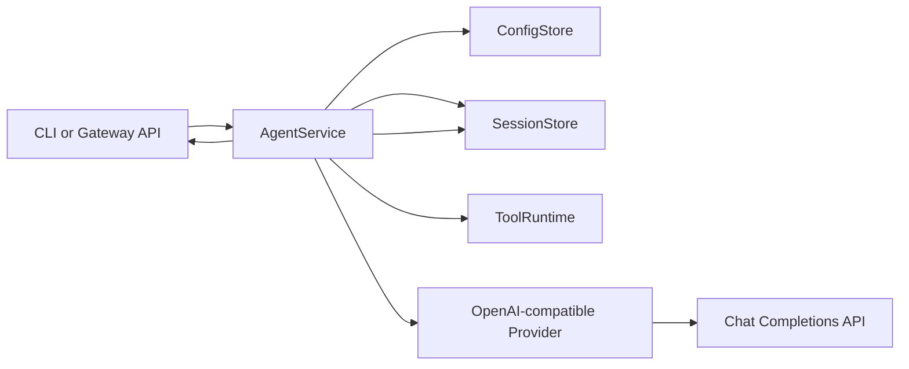

# dart_sub_claw Architecture

## Design Goal

`dart_sub_claw` should start as a compact, understandable Dart core rather than a direct port of every OpenClaw subsystem.
The first implementation keeps the same high-level shape as OpenClaw but chooses smaller contracts:

- CLI as the operator surface.
- Gateway as a local control plane.
- Agent service as the core message execution path.
- Tool runtime for controlled local actions.
- Provider abstraction for model calls.
- Session store for durable conversation history.
- Channel abstraction reserved for later messaging integrations.

## OpenClaw Mapping

| OpenClaw area | Current TypeScript path | Dart MVP equivalent |
| --- | --- | --- |
| CLI bootstrap | `src/entry.ts`, `src/cli/program/build-program.ts` | `bin/dart_sub_claw.dart`, executable `dartsub`, `lib/src/cli/cli.dart` |
| Command registration | `src/cli/program/command-registry.ts` | Small switch-based CLI dispatcher |
| Agent turn | `src/commands/agent.ts` | `lib/src/agent/agent_service.dart` |
| Tools | `src/agents/tools/*` | `lib/src/tools/tool_runtime.dart` |
| Gateway | `src/gateway/server.impl.ts` | `lib/src/gateway/gateway_server.dart` |
| TUI | `src/cli/tui-cli.ts` | `lib/src/tui/repl_tui.dart` |
| Doctor | `src/commands/doctor-*.ts` | `lib/src/doctor/doctor.dart` |
| Provider/model call | `src/agents/*` | `lib/src/providers/*` |
| Sessions | `src/config/sessions.ts`, `src/commands/agent/session*.ts` | `lib/src/sessions/*` |
| Channels | `src/channels/*`, `extensions/*` | `lib/src/channels/channel.dart` |
| Media | `src/media/*` | Not implemented yet |
| Plugins | `src/plugins/*`, `extensions/*` | Not implemented yet |

## Runtime Flow



## Modules

### CLI

`lib/src/cli/cli.dart` is deliberately simple. It supports:

- `agent --message <text> [--session <id>]`
- `gateway run [--host <host>] [--port <port>]`
- `tui [--env <name>] [--session <id>] [--history <n>]`
- `doctor [--env <name>] [--skip-model]`
- `config list`
- `config get <key>`
- `config set <key> <value>`

This avoids committing early to a third-party argument parser. If command complexity grows, the CLI layer can be replaced without changing the core services.

### TUI

`lib/src/tui/repl_tui.dart` is a `dart_tui` terminal chat built with the package Model-Update-View runtime.

Supported commands:

- `/help`
- `/status`
- `/history`
- `/session <id>`
- `/env <name|default>`
- `/clear`
- `/cancel`
- `/exit`

The TUI uses `AgentService` directly, so it exercises the same provider, config, and session path as `dartsub agent`.
Assistant replies stream to the terminal as provider chunks arrive; after the stream completes, the accumulated reply is appended to the JSONL session. Esc and `/cancel` cancel the active stream through a shared cancellation token. Cancelled turns keep the user message for auditability but do not persist a partial assistant reply.

Mouse tracking and alternate screen are disabled by default so terminal selection and copy continue to work from normal scrollback. Users can opt in with `dartsub tui --mouse` when they want mouse-wheel scrolling inside the TUI, or `dartsub tui --alt-screen` when they want the previous fullscreen-style terminal surface.

When a model requests a dangerous tool, the TUI pauses the turn and asks for confirmation. Pressing `y` allows that single tool call; pressing `n` or Esc denies it and returns a `permission_denied` tool result to the model.

Some OpenAI-compatible providers do not reliably follow the exact internal tool wrapper. `ToolRuntime` therefore accepts the strict form and common near-misses, including a tool call embedded after short natural language, a tool name before the JSON payload, and a missing closing `</tool_call>` tag. The TUI clears any leaked in-progress tool text when the permission prompt opens.

OpenClaw's TypeScript TUI uses a dedicated `ChatLog` container next to a dedicated editor component (`src/tui/components/chat-log.ts`, `src/tui/components/custom-editor.ts`, `src/tui/tui.ts`). The Dart TUI follows the same separation at the state-model level: chat history rendering, scroll offset, and input editing are separate pieces of `_ChatTuiModel`.

The input line stores state in `dart_tui`'s `TextInputModel`, but `dartsub` applies its own character-level editing wrapper. This keeps `Backspace`, `Ctrl-H`, pasted text, cursor movement, Chinese input, and wide-character display predictable across terminals. Up and Down navigate the current session's previous user inputs while preserving an unsent draft. PageUp, PageDown, Ctrl-U, Ctrl-D, Ctrl-G, and optional mouse wheel events control the chat history viewport instead of modifying the input field. Ctrl-C follows OpenClaw's interactive behavior: it clears current input first, then exits only after a second press while input is empty. Unsupported `unknown` escape events are ignored so older mouse escape sequences cannot leak coordinate bytes into the text field. The TUI also disables `dart_tui`'s cell renderer because it diffs grapheme clusters as single terminal cells, which causes CJK text to drift on terminals where those characters occupy two columns.

`test/tui_smoke_test.dart` drives the TUI through `expect` and covers exit, `Backspace`, `Ctrl-H`, input history recall, Ctrl-C behavior, mouse wheel safety, chat history scrolling, Esc cancellation, `/cancel`, and dangerous tool allow/deny prompts.

### Doctor

`lib/src/doctor/doctor.dart` performs read-mostly runtime checks:

- Config file can be loaded or created.
- Selected environment is configured or falls back to default.
- Provider kind, base URL, and model are usable.
- API key is present either directly or via `provider.apiKeyEnv`.
- Gateway host and port are available.
- Session directory can be created and listed.
- Model connectivity succeeds unless `--skip-model` is passed.

The model check sends a tiny non-streaming chat completion request through the selected provider.

### Config

`ConfigStore` persists JSON to `~/.dart_sub_claw/config.json` unless `DART_SUB_CLAW_HOME` is set.

Supported config keys:

- `provider.kind`
- `provider.baseUrl`
- `provider.model`
- `provider.apiKey`
- `provider.apiKeyEnv`
- `provider.timeoutSeconds`
- `provider.maxRetries`
- `provider.retryBackoffMs`
- `gateway.host`
- `gateway.port`
- `toolPolicy.tools.<tool>`
- `toolPolicy.sessions.<session>.<tool>`

The default provider kind is `openai-compatible`. The API key can be stored directly for local experiments, but the preferred path is `provider.apiKeyEnv`.

Named environments are stored under `environments.<name>` and can override the provider and gateway config. Use `--env <name>` on `agent`, `gateway`, and `config` commands:

```sh
dartsub config --env test set provider.baseUrl https://ark.cn-beijing.volces.com/api/v3
dartsub agent --env test --message "hello"
dartsub gateway run --env test
```

### Agent Service

`AgentService` owns the core turn:

1. Validate input.
2. Ensure config exists.
3. Load prior messages from the session.
4. Append the user message.
5. Call the provider with the full history and tool instructions.
6. Execute requested tool calls when the assistant replies with the internal tool protocol.
7. Append the final assistant reply.
8. Return the reply.

This is the first stable boundary. Routing, streaming, and channel metadata should attach around this service rather than leaking into the provider. Streaming turns accept a cancellation token so TUI controls can stop an in-flight request without committing partial assistant text.

### Tool Runtime

`lib/src/tools/tool_runtime.dart` defines the MVP tool schema and executor. The current tools are:

- `read_file`: read UTF-8 text from a file under the current working directory. This is classified as `safeRead` and is allowed by default.
- `write_file`: write UTF-8 text to a file under the current working directory. This is classified as `dangerous`.
- `shell`: run a non-interactive shell command in the current working directory. This is classified as `dangerous`.

The provider protocol is intentionally text-based for compatibility with any OpenAI-compatible chat endpoint. If the model needs a tool, it must reply with only:

```text
<tool_call>{"tool":"read_file","arguments":{"path":"README.md"}}</tool_call>
```

`AgentService` executes at most four tool steps, then asks the model to continue with the final answer. Tool result messages are only part of the in-memory provider context for that turn; the JSONL session stores the original user message and final assistant reply, not the internal tool call transcript.

`ToolRuntime` defaults to a read-only policy: safe read tools run automatically, and dangerous tools are denied unless the caller provides a permission handler or persisted policy. Persisted policy supports global per-tool decisions and session-scoped overrides under `toolPolicy.tools.<tool>` and `toolPolicy.sessions.<session>.<tool>`, using `ask`, `allow`, or `deny`.

The TUI provides an interactive handler for dangerous tools: `y` allows one call, `a` allows and remembers the tool for the current session, and `n` denies. `agent` and `gateway` do not prompt, so they only run dangerous tools when policy explicitly allows them. For confirmed TUI writes, `write_file` accepts paths under the current working directory and the current user's `Downloads` directory.

File tools reject paths that escape the process working directory. Shell commands are non-interactive, run with a timeout, and return truncated stdout/stderr.

### Provider

`OpenAiCompatibleProvider` calls:

```text
POST {provider.baseUrl}/chat/completions
```

It expects:

```text
choices[0].message.content
```

For detailed callers, provider responses are normalized into `ChatCompletionResult` with optional `ChatCompletionMetadata`. The metadata carries the response `model`, `finishReason`, `usage`, and selected raw top-level provider fields such as `id`, `object`, `created`, and `system_fingerprint`.

For streaming, it sends `stream: true` and parses server-sent event `data:` lines. Deltas are read from:

```text
choices[0].delta.content
```

Streaming detailed callers receive `ChatStreamEvent` values. Delta events carry text chunks, while metadata-only events can update the accumulated metadata for the final turn result.

Provider calls use a bounded runtime policy from config:

- `provider.timeoutSeconds`: total timeout for request setup, response reads, and stream idle waits.
- `provider.maxRetries`: retry count after the first attempt.
- `provider.retryBackoffMs`: base retry delay, doubled per retry attempt.

Non-streaming calls retry timeout, connection errors, HTTP 429, and HTTP 5xx responses. Streaming calls retry only before the first delta is emitted; after any delta reaches the caller, the provider does not retry because that could duplicate assistant text.

### Gateway

`GatewayServer` uses `dart:io` only.

Current endpoints:

- `GET /health`
- `GET /sessions`
- `POST /agent`
- `POST /agent/stream`
- `WS /events`

The gateway broadcasts coarse lifecycle events:

- `hello`
- `agent.started`
- `agent.delta`
- `agent.completed`
- `agent.cancelled`
- `error`

`POST /agent` remains the simple JSON request-response path. Successful responses include `requestId`, `sessionId`, `reply`, and `metadata` when the selected provider exposes it. `POST /agent/stream` returns server-sent events named `started`, `delta`, `completed`, `cancelled`, and `error`; completed events also include `metadata` when available. Every `/agent`, `/agent/stream`, and WebSocket lifecycle event for a turn carries the same `requestId`, which gives future UIs and channel adapters a stable key for logs, cancellation controls, retries, and error display.

Gateway errors use top-level `code`, `message`, and `requestId` fields. Current error codes are:

- `validation_error`
- `provider_error`
- `provider_timeout`
- `cancelled`
- `internal_error`
- `not_found`

Client disconnects cancel the active provider request through the same cancellation token used by the TUI, so a disconnected stream does not persist partial assistant text.

When the gateway is started with `--env test`, `/agent` and `/agent/stream` use that environment by default. A request body can override it with an `environment` field.

### Sessions

Sessions are JSONL files:

```text
~/.dart_sub_claw/sessions/default.jsonl
```

Each line is:

```json
{"role":"user","content":"hello","createdAt":"2026-05-15T00:00:00.000Z"}
```

JSONL is intentionally chosen because it is append-friendly and easy to inspect during early development.

### Channels

`lib/src/channels/channel.dart` defines only the future adapter shape. No real messaging channel is implemented yet.

The first real channel should probably be a webhook channel or Telegram. WhatsApp, Discord, Slack, Signal, iMessage, plugins, media, pairing, allowlists, and command gating should come after the core loop is stable.

## Non Goals For MVP

- No OpenClaw config compatibility.
- No plugin system.
- No media pipeline.
- No channel auth, pairing, or allowlists.
- No daemon/service installer.
- No fallback model routing.
- No Codex/Claude/Pi CLI backend support.
- No browser automation.
- No mobile/macOS app integration.

## Compatibility Rules

During early development, keep `dart_sub_claw` isolated:

- Do not write to `~/.openclaw`.
- Do not bind the same default port as OpenClaw.
- Do not assume OpenClaw plugin packages can be loaded by Dart.
- Treat this as a new implementation that may later gain import/export bridges.
