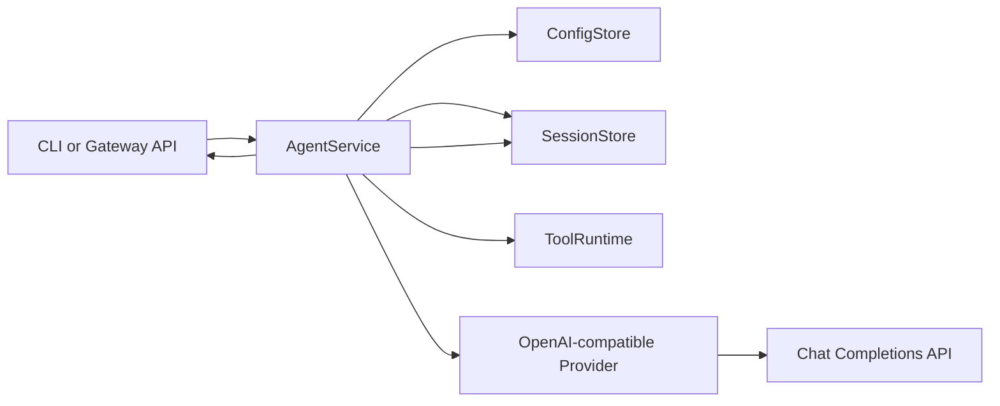

# dart_sub_claw 架构

## 设计目标

`dart_sub_claw` 应该从一个紧凑、易理解的 Dart 核心开始，而不是直接移植 OpenClaw 的每一个子系统。
第一版实现保留与 OpenClaw 相同的高层形态，但选择更小的契约：

- CLI 作为操作员界面。
- Gateway 作为本地控制平面。
- Agent service 作为核心消息执行路径。
- Tool runtime 用于受控的本地操作。
- Provider abstraction 用于模型调用。
- Session store 用于持久化会话历史。
- Channel abstraction 预留给后续消息集成。

## OpenClaw 映射

| OpenClaw 区域     | 当前 TypeScript 路径                                       | Dart MVP 对应实现                                                      |
| ----------------- | ---------------------------------------------------------- | ---------------------------------------------------------------------- |
| CLI 引导          | `src/entry.ts`, `src/cli/program/build-program.ts`         | `bin/dart_sub_claw.dart`, executable `dartsub`, `lib/src/cli/cli.dart` |
| 命令注册          | `src/cli/program/command-registry.ts`                      | 小型的基于 switch 的 CLI 分发器                                        |
| Agent 回合        | `src/commands/agent.ts`                                    | `lib/src/agent/agent_service.dart`                                     |
| 工具              | `src/agents/tools/*`                                       | `lib/src/tools/tool_runtime.dart`                                      |
| Gateway           | `src/gateway/server.impl.ts`                               | `lib/src/gateway/gateway_server.dart`                                  |
| TUI               | `src/cli/tui-cli.ts`                                       | `lib/src/tui/repl_tui.dart`                                            |
| Doctor            | `src/commands/doctor-*.ts`                                 | `lib/src/doctor/doctor.dart`                                           |
| Provider/模型调用 | `src/agents/*`                                             | `lib/src/providers/*`                                                  |
| Sessions          | `src/config/sessions.ts`, `src/commands/agent/session*.ts` | `lib/src/sessions/*`                                                   |
| Channels          | `src/channels/*`, `extensions/*`                           | `lib/src/channels/channel.dart`                                        |
| Media             | `src/media/*`                                              | 尚未实现                                                               |
| Plugins           | `src/plugins/*`, `extensions/*`                            | 尚未实现                                                               |

## 运行时流程



## 模块

### CLI

`lib/src/cli/cli.dart` 有意保持简单。它支持：

- `agent --message <text> [--session <id>]`
- `gateway run [--host <host>] [--port <port>]`
- `tui [--env <name>] [--session <id>] [--history <n>]`
- `doctor [--env <name>] [--skip-model]`
- `config list`
- `config get <key>`
- `config set <key> <value>`

这样可以避免过早绑定到第三方参数解析器。如果命令复杂度增长，CLI 层可以被替换，而不需要改变核心服务。

### TUI

`lib/src/tui/repl_tui.dart` 是一个使用 package Model-Update-View 运行时构建的 `dart_tui` 终端聊天界面。

支持的命令：

- `/help`
- `/status`
- `/history`
- `/session <id>`
- `/env <name|default>`
- `/clear`
- `/cancel`
- `/exit`

TUI 直接使用 `AgentService`，因此它会走与 `dartsub agent` 相同的 provider、config 和 session 路径。
当 provider chunk 到达时，助手回复会流式输出到终端；流结束后，累积的回复会追加到 JSONL session。Esc 和 `/cancel` 会通过共享 cancellation token 取消活动流。被取消的回合会保留用户消息以便审计，但不会持久化部分助手回复。

默认禁用鼠标跟踪和备用屏幕，以便终端选择和复制仍然可以从普通滚屏中工作。用户可以在需要 TUI 内鼠标滚轮滚动时用 `dartsub tui --mouse` 主动开启，或在需要之前那种全屏终端界面时用 `dartsub tui --alt-screen` 开启。

当模型请求危险工具时，TUI 会暂停该回合并请求确认。按 `y` 允许这一次工具调用；按 `n` 或 Esc 会拒绝它，并向模型返回 `permission_denied` 工具结果。

某些 OpenAI-compatible provider 不能稳定遵循精确的内部工具包装格式。因此，`ToolRuntime` 同时接受严格格式和常见近似格式，包括短自然语言之后嵌入的工具调用、JSON payload 之前出现的工具名称，以及缺失闭合 `</tool_call>` 标签的情况。当权限提示打开时，TUI 会清除任何泄漏的进行中工具文本。

OpenClaw 的 TypeScript TUI 使用专用的 `ChatLog` 容器，并搭配专用编辑器组件（`src/tui/components/chat-log.ts`, `src/tui/components/custom-editor.ts`, `src/tui/tui.ts`）。Dart TUI 在状态模型层面遵循同样的分离方式：聊天历史渲染、滚动偏移和输入编辑分别是 `_ChatTuiModel` 的独立部分。

输入行将状态存储在 `dart_tui` 的 `TextInputModel` 中，但 `dartsub` 会应用自己的字符级编辑包装层。这样可以让 `Backspace`、`Ctrl-H`、粘贴文本、光标移动、中文输入和宽字符显示在不同终端中保持可预测。Up 和 Down 会在当前 session 之前的用户输入中导航，同时保留尚未发送的草稿。PageUp、PageDown、Ctrl-U、Ctrl-D、Ctrl-G 以及可选的鼠标滚轮事件控制聊天历史视口，而不是修改输入框。Ctrl-C 遵循 OpenClaw 的交互行为：先清空当前输入，只有在输入为空时第二次按下才会退出。不支持的 `unknown` escape 事件会被忽略，防止旧版鼠标 escape 序列把坐标字节泄漏到文本字段中。TUI 还禁用了 `dart_tui` 的 cell renderer，因为它会把 grapheme cluster 作为单个终端 cell 进行 diff，这会导致 CJK 文本在这些字符占用两列的终端中发生漂移。

`test/tui_smoke_test.dart` 通过 `expect` 驱动 TUI，并覆盖退出、`Backspace`、`Ctrl-H`、输入历史召回、Ctrl-C 行为、鼠标滚轮安全性、聊天历史滚动、Esc 取消、`/cancel`，以及危险工具的允许/拒绝提示。

### Doctor

`lib/src/doctor/doctor.dart` 执行以读取为主的运行时检查：

- Config 文件可以被加载或创建。
- 所选 environment 已配置，或回退到 default。
- Provider kind、base URL 和 model 可用。
- API key 可以直接获取，或通过 `provider.apiKeyEnv` 获取。
- Gateway host 和 port 可用。
- Session 目录可以被创建和列出。
- 除非传入 `--skip-model`，否则模型连接检查成功。

模型检查会通过所选 provider 发送一个很小的非流式 chat completion 请求。

### Config

除非设置了 `DART_SUB_CLAW_HOME`，否则 `ConfigStore` 会把 JSON 持久化到 `~/.dart_sub_claw/config.json`。

支持的 config key：

- `provider.kind`
- `provider.baseUrl`
- `provider.model`
- `provider.apiKey`
- `provider.apiKeyEnv`
- `provider.timeoutSeconds`
- `provider.maxRetries`
- `provider.retryBackoffMs`
- `gateway.host`
- `gateway.port`
- `toolPolicy.tools.<tool>`
- `toolPolicy.sessions.<session>.<tool>`

默认 provider kind 是 `openai-compatible`。API key 可以直接保存，用于本地实验，但更推荐的路径是 `provider.apiKeyEnv`。

命名 environment 存储在 `environments.<name>` 下，可以覆盖 provider 和 gateway config。在 `agent`、`gateway` 和 `config` 命令中使用 `--env <name>`：

```sh
dartsub config --env test set provider.baseUrl https://ark.cn-beijing.volces.com/api/v3
dartsub agent --env test --message "hello"
dartsub gateway run --env test
```

### Agent Service

`AgentService` 负责核心回合：

1. 校验输入。
2. 确保 config 存在。
3. 从 session 加载历史消息。
4. 追加用户消息。
5. 使用完整历史和工具指令调用 provider。
6. 当助手以内部工具协议回复时，执行所请求的工具调用。
7. 追加最终助手回复。
8. 返回回复。

这是第一个稳定边界。Routing、streaming 和 channel metadata 应该围绕这个服务接入，而不是泄漏进 provider。流式回合接受 cancellation token，因此 TUI 控件可以停止进行中的请求，而不提交部分助手文本。

### Tool Runtime

`lib/src/tools/tool_runtime.dart` 定义 MVP 工具 schema 和 executor。当前工具包括：

- `read_file`：从当前工作目录下读取 UTF-8 文本文件。它被归类为 `safeRead`，默认允许。
- `write_file`：向当前工作目录下写入 UTF-8 文本文件。它被归类为 `dangerous`。
- `shell`：在当前工作目录中运行非交互式 shell 命令。它被归类为 `dangerous`。

Provider 协议有意基于文本，以兼容任意 OpenAI-compatible chat endpoint。如果模型需要工具，它必须只回复：

```text
<tool_call>{"tool":"read_file","arguments":{"path":"README.md"}}</tool_call>
```

`AgentService` 最多执行四个工具步骤，然后要求模型继续给出最终答案。工具结果消息只属于该回合的内存 provider context；JSONL session 存储原始用户消息和最终助手回复，不存储内部工具调用 transcript。

`ToolRuntime` 默认使用只读策略：safe read 工具会自动运行，dangerous 工具会被拒绝，除非调用方提供 permission handler 或持久化策略。持久化策略支持全局的 per-tool 决策和 session-scoped override，位置在 `toolPolicy.tools.<tool>` 和 `toolPolicy.sessions.<session>.<tool>` 下，取值为 `ask`、`allow` 或 `deny`。

TUI 为危险工具提供交互式 handler：`y` 允许一次调用，`a` 允许并为当前 session 记住该工具，`n` 拒绝。`agent` 和 `gateway` 不会弹出提示，因此只有策略显式允许时才会运行危险工具。对于已确认的 TUI 写入，`write_file` 接受当前工作目录和当前用户 `Downloads` 目录下的路径。

文件工具会拒绝逃逸出进程工作目录的路径。Shell 命令是非交互式的，会带 timeout 运行，并返回截断后的 stdout/stderr。

### Provider

`OpenAiCompatibleProvider` 调用：

```text
POST {provider.baseUrl}/chat/completions
```

它期望：

```text
choices[0].message.content
```

对于需要详细信息的调用方，provider 响应会被规范化为 `ChatCompletionResult`，并可带 `ChatCompletionMetadata`。metadata 携带响应的 `model`、`finishReason`、`usage`，以及选定的原始顶层 provider 字段，例如 `id`、`object`、`created` 和 `system_fingerprint`。

流式模式下，它发送 `stream: true` 并解析 server-sent event `data:` 行。Delta 会从这里读取：

```text
choices[0].delta.content
```

流式详细调用方会收到 `ChatStreamEvent` 值。Delta 事件携带文本 chunk，而只含 metadata 的事件可以更新最终回合结果累积的 metadata。

Provider 调用使用来自 config 的有界运行时策略：

- `provider.timeoutSeconds`：请求建立、响应读取和流空闲等待的总 timeout。
- `provider.maxRetries`：首次尝试之后的 retry 次数。
- `provider.retryBackoffMs`：基础 retry delay，每次 retry 翻倍。

非流式调用会在 timeout、连接错误、HTTP 429 和 HTTP 5xx 响应时 retry。流式调用只会在第一个 delta 发出前 retry；一旦有任何 delta 到达调用方，provider 就不会 retry，因为这可能重复助手文本。

### Gateway

`GatewayServer` 仅使用 `dart:io`。

当前 endpoint：

- `GET /health`
- `GET /sessions`
- `POST /agent`
- `POST /agent/stream`
- `WS /events`

Gateway 会广播粗粒度 lifecycle event：

- `hello`
- `agent.started`
- `agent.delta`
- `agent.completed`
- `agent.cancelled`
- `error`

`POST /agent` 仍然是简单的 JSON request-response 路径。成功响应包含 `requestId`、`sessionId`、`reply`，并在所选 provider 暴露 metadata 时包含 `metadata`。`POST /agent/stream` 返回名为 `started`、`delta`、`completed`、`cancelled` 和 `error` 的 server-sent event；completed 事件也会在可用时包含 `metadata`。某个回合的每个 `/agent`、`/agent/stream` 和 WebSocket lifecycle event 都携带同一个 `requestId`，为未来 UI 和 channel adapter 提供稳定的日志、取消控件、retry 和错误展示 key。

Gateway 错误使用顶层 `code`、`message` 和 `requestId` 字段。当前错误码包括：

- `validation_error`
- `provider_error`
- `provider_timeout`
- `cancelled`
- `internal_error`
- `not_found`

客户端断开连接会通过与 TUI 相同的 cancellation token 取消活动 provider 请求，因此断开的流不会持久化部分助手文本。

当 gateway 以 `--env test` 启动时，`/agent` 和 `/agent/stream` 默认使用该 environment。请求体可以通过 `environment` 字段覆盖它。

### Sessions

Sessions 是 JSONL 文件：

```text
~/.dart_sub_claw/sessions/default.jsonl
```

每一行都是：

```json
{ "role": "user", "content": "hello", "createdAt": "2026-05-15T00:00:00.000Z" }
```

有意选择 JSONL，是因为它便于追加，并且在早期开发中容易检查。

### Channels

`lib/src/channels/channel.dart` 只定义未来的 adapter 形状。当前尚未实现真实消息 channel。

第一个真实 channel 可能应该是 webhook channel 或 Telegram。WhatsApp、Discord、Slack、Signal、iMessage、plugins、media、pairing、allowlists 和 command gating 应该在核心循环稳定之后再加入。

## MVP 非目标

- 不兼容 OpenClaw config。
- 不实现 plugin system。
- 不实现 media pipeline。
- 不实现 channel auth、pairing 或 allowlists。
- 不实现 daemon/service installer。
- 不实现 fallback model routing。
- 不支持 Codex/Claude/Pi CLI backend。
- 不实现 browser automation。
- 不集成 mobile/macOS app。

## 兼容性规则

在早期开发期间，让 `dart_sub_claw` 保持隔离：

- 不写入 `~/.openclaw`。
- 不绑定与 OpenClaw 相同的默认端口。
- 不假设 OpenClaw plugin package 可以被 Dart 加载。
- 将它视为一个新的实现，之后可能会获得 import/export bridge。
